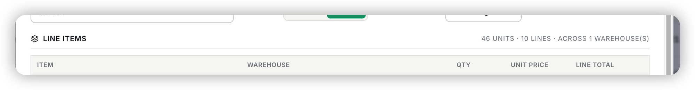

## Ask

> A few update to the sell order.
>
> 1. instead of a pop up page, I hope sell order can also have it dedicated full pages.
> 2. The sell order can show by PO or by wareshouse. some switch button here. [Image #1]
> 3. The sell order line should also show tag style spec, like desktop or server, rank, speed info.

Answers to the two scoping questions:

> From Inventory, 'Add to sell order' … Once sell orders have a full page, what
> should that path do? — **Open the full page**

> Inventory → 'Create sell order' (the new-order builder) is a popup too. Should
> it become a page in this change? — **No, existing orders only**

## Context

On desktop, opening a sell order (`#/sell-orders/:id`, `#/sell-orders/:id/edit`)
showed `SellOrderDetail` as a `<Modal>` over the list. The modal was 760px wide
in view mode and 1100px in edit mode, with the body capped at 70vh, so a
ten-line order scrolled inside a box. The Inventory "Add to sell order" action
(v1.175.0) mounted the same modal with the selection appended.

The view grouped lines by the warehouse saved on each line and linked every
line "From PO-…". The edit form was a flat table with a Warehouse column; that
is the screenshot. "By PO" existed only as the `Packing list by PO` download
(v1.189.0).

Lines carried no structured spec. `GET /api/sell-orders/:id` already joined the
line's lot (`order_lines`) for `sourceOrderId`, and `LineSpecChips` already
renders the Desktop/Server · RDIMM · rank · speed pills on the box check page.

## Acceptance criteria

- [x] `#/sell-orders/:id` and `/:id/edit` render a full page in place of the
      list, with no modal. Back returns to the list with its status filter and
      search intact.
- [x] Line items have a By warehouse / By PO switch in both view and edit
      modes. The choice is remembered per user as a preference.
- [x] By PO: one group per source PO, in numeric order and linked. Hand-typed
      lines go under "No PO", last. A Warehouse column shows. By warehouse:
      today's grouping, with the "From PO" link per line.
- [x] Each RAM line shows Desktop/Server · classification · rank · speed chips,
      and SSD/HDD lines show their chips. A line with no linked lot falls back
      to its saved spec text.
- [x] Lines added in edit mode (from the picker or Inventory) show chips and
      group by PO before saving.
- [x] Inventory → Add to sell order opens the order's edit page with the
      selection appended. Save lands on the order page and clears the
      Inventory selection; leaving without saving keeps it.

## Out of scope

- The new-order builder (`DesktopSellOrderDraft`, Inventory → Create sell
  order) stays a modal. Jinhu decided this on 2026-10-01.
- A leave-page guard for unsaved edits. The PO page has none either.
- Translating the footer's existing raw-English labels (Archive, Discard,
  Reopen …).

## Notes

- Numbered RS-138: RS-134 was in flight in a peer worktree and RS-133/135 were
  not visible locally, so I took two above the last number seen.
- Plan: `~/.claude/plans/ancient-floating-pretzel.md`.
- **The page is keyed on `id:mode`.** Each switch between view and edit
  remounts and refetches, so Save never shows the pre-save order and Cancel
  never resurrects an abandoned draft. View and edit share one history entry
  (`replaceRoute`), so browser Back leaves the order instead of bouncing
  between its two modes.
- **The Inventory hand-off is a one-shot module stash**
  (`lib/sellOrderPrefill.ts`). It is peeked inside a `useState` initializer,
  which StrictMode runs twice, and cleared on unmount. The `onSaved` hook
  clears Inventory's remembered selection only after the save lands.
- **Rebased over RS-134 (v1.193.0),** which moved Archive / Unarchive out of
  the `editable` gate onto Done and Closed orders. Those are locked, so on the
  page Archive and Unarchive sit in the page head; Discard stays in the edit
  footer.
