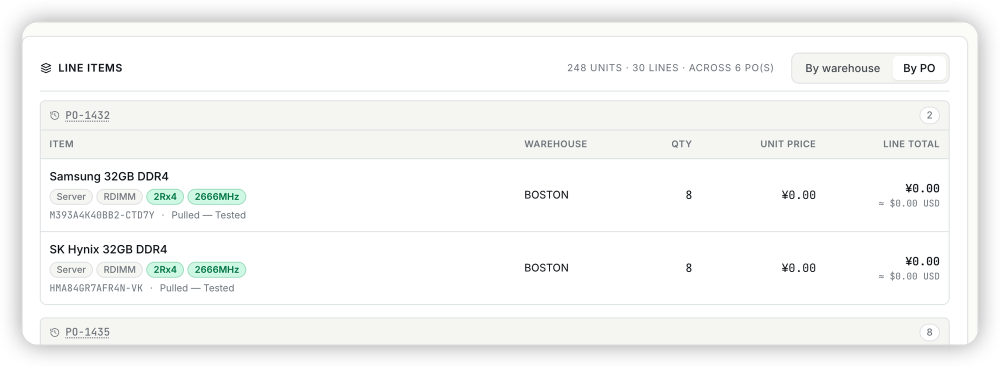
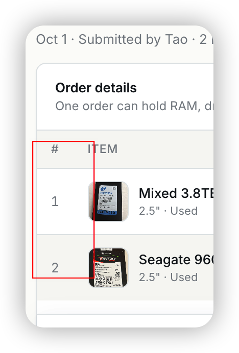

## Ask

> think of the following feature
>
> [Image #2]
> [Image #3]
> In the sell order, It hope it should match the source in the PO.
>
> for example. the #3 in the sell order in the PO. it should also show #3.

## Context

The sell order page (RS-138, v1.194.0) groups its lines By PO, but a line
didn't say which line of that PO it was. The PO page numbers every line in a
`#` column, so matching a sold line back to the PO meant comparing part numbers
by eye.

No line number is stored. Every PO view renders `i + 1` over
`GET /api/orders/:id` lines, which come back in `position` order. Positions have
gaps (removed lines), and a partial inventory transfer clones a line *at the
same position*. So the number is a rank, not `position + 1`, and with
`ORDER BY position` alone the order of tied rows was unspecified.

## Acceptance criteria

- [x] By PO, each PO card has a `#` column that shows the line's number on that
      PO's page, and the card lists its lines in that order. The No PO card has
      no `#` column.
- [x] By warehouse, a line's source reads `From PO-1432 #3`.
- [x] Lines added in edit mode, from the picker or from Inventory → Add to sell
      order, show their number before saving.
- [x] The numbers stay equal to the PO page's numbers across position gaps,
      ties, and partial-transfer clones. A clone sorts after its source, so the
      source keeps its number.

## Out of scope

- The Packing list by PO spreadsheet.
- The new-order builder modal (`DesktopSellOrderDraft`).
- The picker's own rows.
- Showing sell orders on the PO side.

## Notes

- The rule is one SQL fragment, `lib/poLineNo.ts`: 1 + the number of the PO's
  lines that sort before this one by `(position, created_at, id)`. The PO detail
  query and the PO spreadsheet now order by the same key. `created_at` comes
  before `id`, so a transfer clone (fresh `now()`, random UUID) can't land ahead
  of its source.
- Numbers are live, not snapshots. If a PO line is removed, both pages
  renumber together, which is what "match" needs.
- Numbered RS-145: the script offered RS-144, but a busy peer session was cutting
  review tickets at the time, so I took one more.
